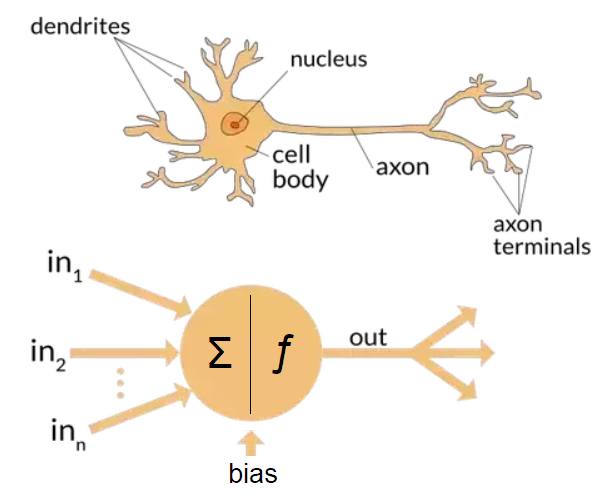
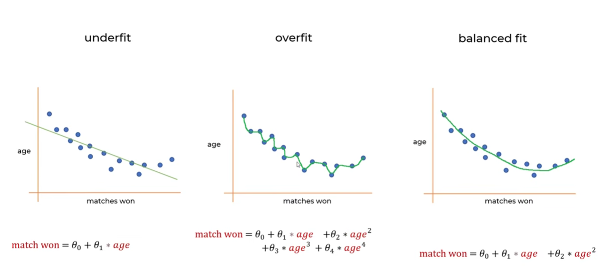
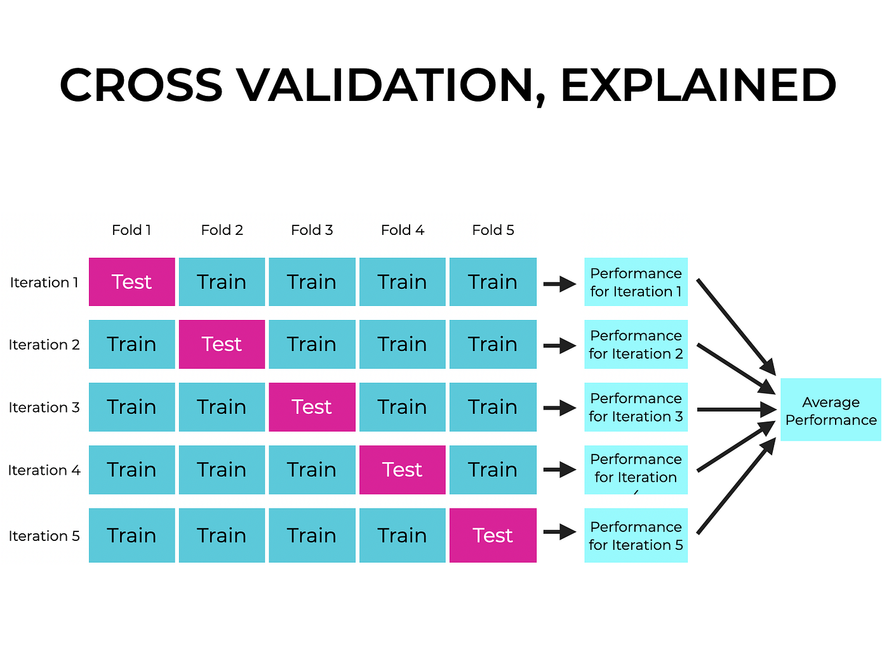
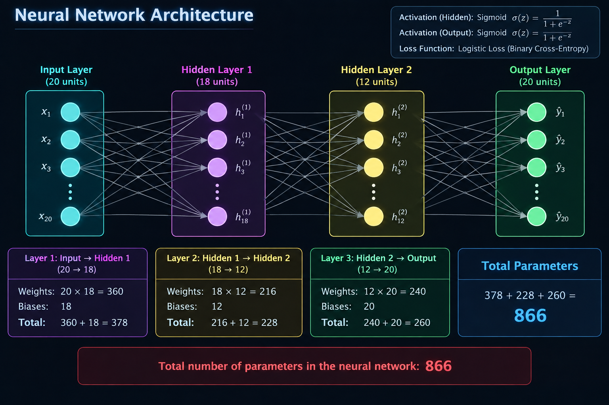
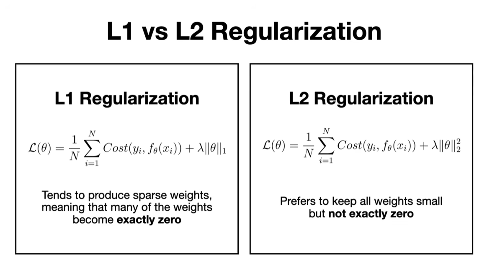
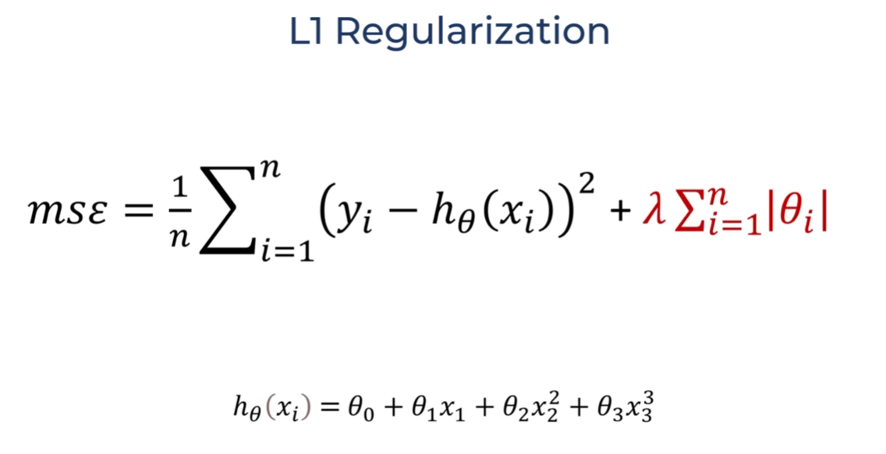
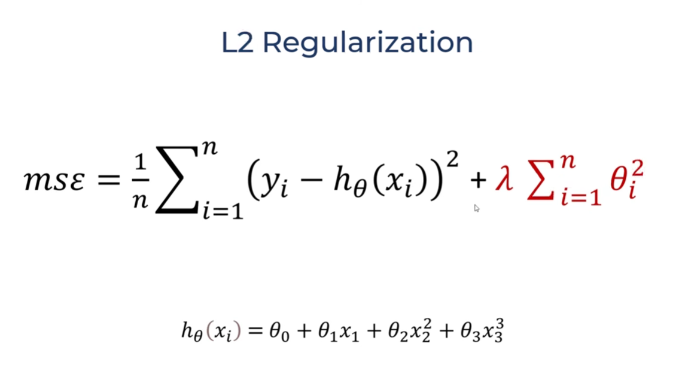

## Small Concepts

### Biological and Human Neuron


### Affine Layer
In Artificial Neural Networks (ANN), an affine layer (or affine transformation) is a mathematical operation that multiplies an input vector by a weight matrix and adds a bias vector.

### Decision Boundary
- In an Artificial Neural Network (ANN), a decision boundary is the mathematical line, surface, or hypersurface that separates different data classes in a feature space. It represents the threshold where the network’s prediction changes from one class to another.
- **For example:** In a simple classification task to separate images of cats from dogs, the decision boundary is the line drawn by the network where anything on one side is classified as a "cat" and anything on the other side is classified as a "dog".
- While simple networks without activation functions can only create straight, linear boundaries, deep ANNs use non-linear activation functions (like ReLU or Sigmoid) to warp and bend this boundary, allowing them to carve out highly complex, multi-dimensional shapes to accurately separate tangled data.

### ROC
- ROC (Receiver Operating Characteristic) and AUC (Area Under the Curve) are performance metrics used to evaluate classification models like Artificial Neural Networks (ANNs)
- An ROC curve is a graph that shows how well an ANN classification model performs at all classification thresholds.
- It plots two things on a graph:
    - True Positive Rate (TPR) / Sensitivity: On the y-axis, showing how many actual positive cases the ANN caught.
    - False Positive Rate (FPR) / 1-Specificity: On the x-axis, showing how many negative cases the ANN wrongly labeled as positive

### AUC
- AUC stands for Area Under the [ROC] Curve.
- It turns the ROC graph into a single numerical score from 0 to 1.
    - Score of 1.0: A perfect ANN model.
    - Score of 0.5: An ANN model that guesses randomly (diagonal line). 
    - Score below 0.5: Worse than random guessing.


### Confusion Matrix
- '[prediction is correct or wrong] [what is predicted]'
- Eg. 
    1. 'False Positive'
        - Prediction = wrong (false), Predicted = positive
        - It means it predicted 'Positive' which was wrong, the actual output should be Negative
    2. 'True Negative'
        - Prediction = correct (true), Predicted = negative
        - It means it predicted 'Negative' which was corret since the actual output is also negative


### Gradient Decent, Loss function and Cost function
- Loss function: calculates error for a single datapoint
- Cost function: calculates the average or total error across an entire dataset
- Gradient Decent:
    - A gradient means slop.
    - The graph of Lose (vs) Weight is made for all the individual weight separately in which gradient is calculated.

### Tanh Activation Function
$$
\tanh(x)=\frac{e^x-e^{-x}}{e^x+e^{-x}}
$$
- It can be used as an output activation when the required output range is [−1, +1].
- It is better than sigmoid activation function as it's values are centered around 0.
- It's maximum derivative is 1 (at x=0).

### Binary Cross-Entropy (BCE) Loss Function
$$
L = -[y\log(\hat{y}) + (1-y)\log(1-\hat{y})]
$$
```
y = actual label (0 or 1)
ŷ = predicted probability between 0 and 1
```
- Used for binary classification problems (e.g., Yes/No, 0/1).
- It measures the difference between the actual label and the predicted probability.
- Usually used with a sigmoid activation in the output layer.
- It is also known as **Linguistic loss**.

### Overfitting and Underfitting


### Cross-validation


# Regression
- Linear Regression
    - Simple Linear Regression `y = w​x​ + b`
    - Multiple Linear Regression `y = w1​x1​ + w2​x2 ​+ b`
- Polynomail Regression
    - `y = w0​ + w1​x + w2​(x^2)`
    - Linear in Parameters vs Nonlinear in Inputs
- Logistic Regression
    - Sigmoid is nonlinear, but logistic regression still has a linear decision boundary.

# NN Calulation
### Forward Propogation
- Given: Initial weights, inputs and actual output
- Calculate all the values of outputs of all the neurons using weighted sum equation (y = w2x2 + w1x1 + b)
- After the predicted output of the final layer is found, then calculate the error
```
E = 1/2 * (y - y')^2

E: loss
y: actual output
y': predicted output
```

### Backpropogation
- Given: Total error (loss) corresponding input
- Now calculate the derivative of Loss w.r.t. each weight
```
dE/dw1, dE/dw2, etc

calculate for all the weights
```
- Now calculate the new weights
```
W(new) = W(old) - η (dE/dW(old))
```

### NN Parameter Count


# Regularization
- **Regularized Loss = Original Loss + Penalty**
- L1 Regularization: Lasso Regularization
- L1 Regularization: Ridge Regularization





| Regularization | Penalty Function | Effect |
|---|---|---|
| **L1 (Lasso)** | `λ Σ\|wᵢ\|` | Can make some weights **zero** |
| **L2 (Ridge)** | `λ Σwᵢ²` | Keeps weights **small** |
| **Elastic Net** | `λ₁ Σ\|wᵢ\| + λ₂ Σwᵢ²` | Combines L1 and L2 |
