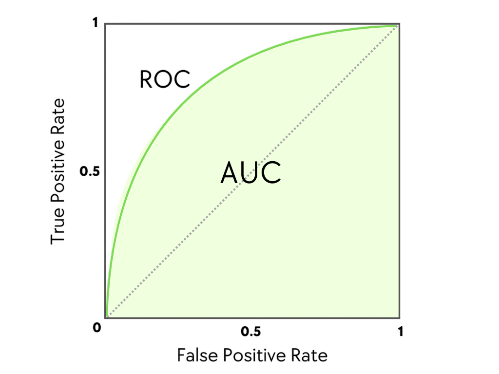
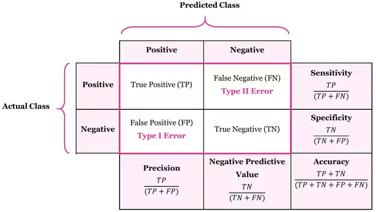

## ROC
- ROC (Receiver Operating Characteristic) and AUC (Area Under the Curve) are performance metrics used to evaluate classification models like Artificial Neural Networks (ANNs)
- An ROC curve is a graph that shows how well an ANN classification model performs at all classification thresholds.
- It plots two things on a graph:
    - True Positive Rate (TPR) / Sensitivity: On the y-axis, showing how many actual positive cases the ANN caught.
    - False Positive Rate (FPR) / 1-Specificity: On the x-axis, showing how many negative cases the ANN wrongly labeled as positive

## AUC
- AUC stands for Area Under the [ROC] Curve.
- It turns the ROC graph into a single numerical score from 0 to 1.
    - Score of 1.0: A perfect ANN model.
    - Score of 0.5: An ANN model that guesses randomly (diagonal line).
    - Score below 0.5: Worse than random guessing.

## Confusion Matrix

