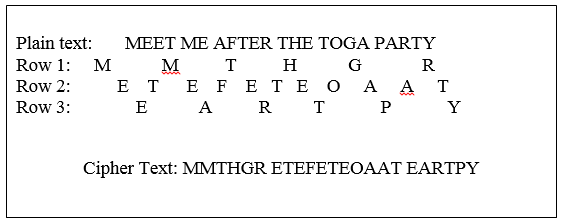
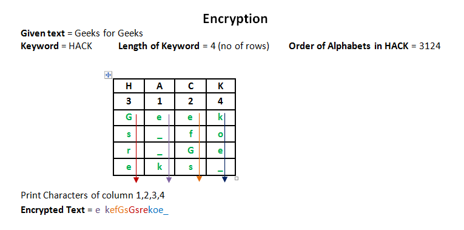

### CIA
- Confidentiality: (hiding secret data)
    - Keeps sensitive data private and hidden from people who should not see it.
    - Common tools: Encryption, multi-factor authentication, and strict access controls.
- Integrity: (data correctness, completeness & no change to data)
    - Ensures data is accurate, complete, and trustworthy. It stops unauthorized changes or tampering.
    - Common tools: Digital signatures, hashing, and version control.
- Availability: (is data available for authorized users)
    - Guarantees that authorized users can access systems and data whenever they need them.
    - Common tools: Reliable backups, redundant servers, and defenses against denial-of-service (DoS) attacks.

### Main protections
- Encryption → protects confidentiality.
- Hash/MAC → protects integrity/authentication.
- Digital signatures → authentication + integrity + non-repudiation.

## Substitution Ciphers
(Characters are replaced with other characters)
- Caesar Cipher - Shift each letter by a fixed amount
- Playfair Cipher
- [Hill Cipher](HillCipher.md) ([code](HillCipher.java))
- Vigenère Cipher
- Vernam Cipher

### Caesar Cipher
- Cipher = (plain text + int(key))mod26
- We shift the characters by `int(key)` times

**Modified Caesar Cipher**

*Method 1:*
- key = "SECRET"
```
plain text =  H E L L O !
cipher text = S E C R E T

range of cipher key = 'SECRETABCDEFGHIJKLMNOPQRSTUVWXYZ'
```

*Method 2:*
- Instead of shifting only 26 characters, you are allowed to shift to all the printable characters


### Playfair Cipher
**Steps**
- Use a 5×5 matrix; combine I/J.
- Remove repeated letters from the key.
- Split plaintext into pairs.
- Same letters → insert X between them.
- Same row: move right.
- Same column: move down.
- Different row & column: form a rectangle and swap columns.
- For decryption, reverse: left, up, rectangle.


### Vigenere Cipher
- `len(plain text) > len(key)`
- In the below image key = `KEY`


### Vernam Cipher
- Same as Vigenere Cipher but `len(plain text) == len(key)`

## Transposition Ciher
(Position of characters are changed)
- Rail Fence Cipher
- Column Transposition Cipher

### Rail Fence Cipher
- In the below image, no. of rows = 3



### Column Transposition Cipher


## Cryptanalysis
- It means trying to break a cryptographic system without knowing the secret key.
- Approaches
    - Brute Force - trying every possible key
    - Cryptanalysis - identify ciphertext pattern, weaknesses in algorithm
- Attack Types:
    - Ciphertext-only attack: only ciphertext available (e.g., frequency analysis).
    - Known-plaintext attack: attacker has some plaintext-ciphertext pairs.
    - Chosen-plaintext attack: attacker can choose plaintext and see its ciphertext.
    - Chosen-ciphertext attack: attacker can choose ciphertext and obtain its decrypted plaintext.

## Steganography
| Encryption                | Steganography                        |
| ------------------------- | ------------------------------------ |
| Hides meaning             | Hides existence                      |
| Ciphertext is visible     | Secret message may not be noticeable |
| Uses encryption algorithm | Uses hiding technique                |

## Stream Cipher vs Block Cipher
- Stream cipher: Encrypts data bit-by-bit or byte-by-byte.
- Block cipher: Encrypts a fixed-size block at once.
    - Eg. AES, DES,  IDEA

### Intruders, Viruses, and Related Threats
- Intruders are classified into three types:
    - Masquerader — an unauthorized outsider who penetrates a system using a legitimate user's account.
    - Misfeasor — a legitimate user who accesses resources they're not authorized for, or misuses authorized access.
    - Clandestine user — someone who seizes supervisory/admin control to evade auditing and access controls.

### Malicious software (malware) categories:
- Virus — attaches itself to a host program/file and spreads when that file is executed or shared; needs a host to propagate.
- Worm — a standalone program that self-replicates and spreads across networks without needing to attach to another file.
- Trojan horse — appears to perform a useful function but secretly carries out malicious actions.
- Logic bomb — malicious code that lies dormant until triggered by a specific condition (date, event).
- Backdoor/trapdoor — a hidden entry point bypassing normal authentication.
- Zombie/bot — a program that covertly takes control of another system, often to launch coordinated attacks (e.g., DDoS via a botnet).

