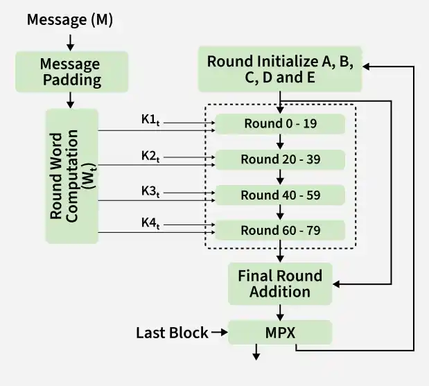

## Conventional / Symmetric Encryption
- Same secret key is used by both parties.

### Algorithms
- DES
- AES
- IDEA

### Location of Encryption Devices
- Link Encryption
    - Encryption occurs between two directly connected network devices.
    - Each network link can be protected separately.
    ```
    A ──[Encrypt]── Network ──[Decrypt]── B
    ```
- End-to-End Encryption
    - Encryption happens at the endpoints.
    ```
    A
    ↓
    [Encrypt]
    ↓
    Network
    ↓
    [Decrypt]
    ↓
    B
    ```

### Cipher Block Modes
- ECB: Electronic Codebook
- CBC: Cipher Block Chaining
- CFB: Cipher Feedback
- OFB: Output Feedback
- CTR: Counter

#### ECB
- Every block Completely separate.

#### CBC
- Each plaintext block is XORed with the previous ciphertext block.

$$ C_i = E_K(P_i \oplus C_{i-1}) $$

- where C₀ = IV.
- **Important:** CBC uses an IV (Initialization Vector).

#### CFB
- Turns a block cipher into something similar to a stream cipher.
- Previous ciphertext is fed back into the encryption function.
```
Previous C
    ↓
 Encrypt
    ↓
 Keystream
    ↓ XOR
 Plaintext → Ciphertext
```

#### OFB
- Similar to CFB, but the encryption output itself is fed back.
```
Output
  ↓
Encrypt
  ↓
New Output
  ↓
XOR with plaintext
```

#### CTR
A counter is encrypted and XORed with plaintext.
```
Counter 1 → Encrypt → Keystream → XOR → P1
Counter 2 → Encrypt → Keystream → XOR → P2
Counter 3 → Encrypt → Keystream → XOR → P3
```

## Key Distribution
- **Manual/physical delivery** — a key is physically handed over (courier, secure channel) — secure but doesn't scale.
- **Third-party delivery** — a trusted party physically delivers the key to both ends.
- **Using an existing (older) key** — encrypt a new key using a previously established shared key and send it over the existing secure channel.
- **Using a Key Distribution Center (KDC)** — a trusted server shares a distinct secret key ("master key") with every party in advance; when two parties want to communicate, the KDC generates a one-time session key and securely distributes it to both, encrypted under their respective master keys. This is the scalable approach used in systems like Kerberos.

## Approaches to Message Authentication
- Symmetric Encryption
    - Sender encrypts the message using a shared secret key.
    - Only someone with the key should be able to produce the valid protected message.
- MAC
    - A Message Authentication Code is generated using:
    ```
    Message + Secret Key
            ↓
        MAC
    ```
    - Receiver calculates the MAC again.
    ```
    Received message
        +
    Secret key
        ↓
    Calculate MAC
        ↓
    Compare
    ```
- Cryptographic Hash
    ```
    Message
    ↓
    Hash function
    ↓
    Hash value
    ```

## Secure Hash Function
- A hash function converts data of arbitrary size into a fixed-size value.
- Properties
    - 1. Fixed output: Different-size inputs produce fixed-size hash.
    - 2. Efficient: Hash should be quick to calculate.
    - 3. Preimage Resistance
    ```
    Given: Hash → ?
    It should be computationally infeasible to find the original message.
    ```
    - 4. Collision Resistance: It should be difficult to find any two different messages having the same hash.
    



## HMAC
- HMAC = Hash-based Message Authentication Code
- It combines: `Hash Function + Secret Key`

Basic idea:
```
Message + Secret Key
        ↓
      HMAC
        ↓
 Authentication Tag
```
Receiver uses the same secret key and calculates HMAC again.


$$ HMAC(K,M) = H((K' \oplus opad)\ ||\ H((K' \oplus ipad)\ ||\ M)) $$
```
K → secret key
M → message
ipad → inner padding
opad → outer padding
```

