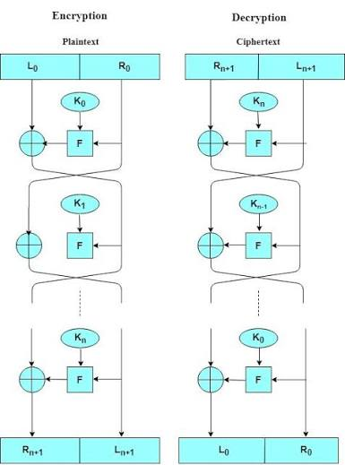
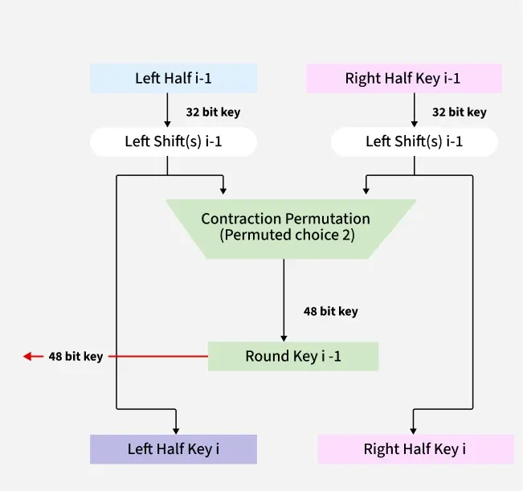

# Modern Block Ciphers
- Important design goals:
    - Confusion
    - Diffusion
    - Large key space
    - Avalanche effect
    - Resistance to cryptanalysis

### Shannon's Confusion and Diffusion
#### Confusion (doing substitution)
- Makes the relationship between the key and the ciphertext as complex/obscure as possible, so that even if an attacker has some statistical information about the ciphertext, they can't easily deduce the key.
- Achieved primarily through substitution (e.g., S-boxes).

#### Diffusion (doing permutation/transposition)
- Spreads the statistical structure of the plaintext across the ciphertext, so that changing a single plaintext bit changes many ciphertext bits (and vice versa), hiding redundancy/patterns in the plaintext.
- Achieved primarily through permutation/transposition.

> Modern block ciphers combine many rounds of substitution (confusion) and permutation (diffusion) to build strong overall security from simple building blocks.

### Feistel Structure
A generic design used by many block ciphers (including DES). Each block is split into two halves, L and R. In each round:

$$ L_i = R_{i-1} $$ $$ R_i = L_{i-1} \oplus F(R_{i-1},K_i) $$

Where:
- L = left half
- R = right half
- Kᵢ = round key
- F = round function




### DES: Data Encryption Standard
- Best explination of DES in this [article](https://medium.com/@ahsanbarkati/the-des-data-encryption-standard-16466b45c30d).
- [Youtube Video](https://www.youtube.com/watch?v=bqDkLhHjGXE)

| Property      | DES         |
| ------------- | ----------- |
| Block size    | **64 bits** |
| Key           | **64 bits** |
| Effective key | **56 bits** |
| Rounds        | **16**      |
| Structure     | **Feistel** |

#### Key Generation
```
64-bit original key
       ↓
     PC-1
       ↓
56-bit key
       ↓
Split into C0 and D0
       ↓
Left shifts
       ↓
     PC-2
       ↓
48-bit Round Key
```

