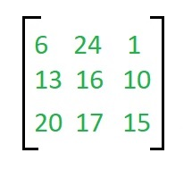
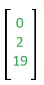
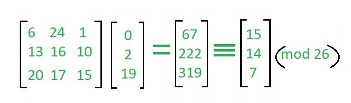

## Hill Cipher
We have to encrypt the message 'ACT' (n=3).The key is 'GYBNQKURP' which can be written as the nxn matrix ,

The message 'ACT' is written as vector,

The enciphered vector is given as,

which corresponds to ciphertext of 'POH' 
