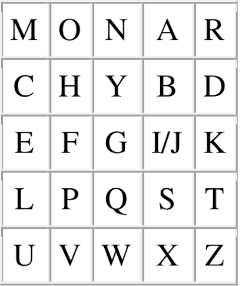
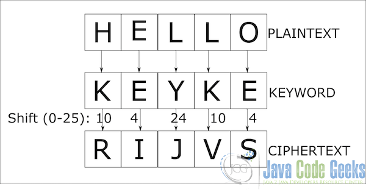

### CIA
- Confidentiality: (hiding secret data)
    - Keeps sensitive data private and hidden from people who should not see it.
    - Common tools: Encryption, multi-factor authentication, and strict access controls.
- Integrity: (data correctness, completeness & no change to data)
    - Ensures data is accurate, complete, and trustworthy. It stops unauthorized changes or tampering.
    - Common tools: Digital signatures, hashing, and version control.
- Availability: (is data available for authorized users)
    - Guarantees that authorized users can access systems and data whenever they need them.
    - Common tools: Reliable backups, redundant servers, and defenses against denial-of-service (DoS) attacks.

### Playfair Cipher


### Caesar Cipher
- Cipher = (plain text + int(key))mod26
- We shift the characters by `int(key)` times

#### Modified Caesar Cipher
**Method 1:**<br>
- key = "SECRET"
```
plain text =  H E L L O !
cipher text = S E C R E T

range of cipher key = 'SECRETABCDEFGHIJKLMNOPQRSTUVWXYZ'
```

**Method 2:**<br>
- Instead of shifting only 26 characters, you are allowed to shift to all the printable characters

### Vigenere Cipher
- `len(plain text) > len(key)`
- In the below image key = `KEY`


### Vernam Cipher
- Same as Vigenere Cipher but `len(plain text) == len(key)`