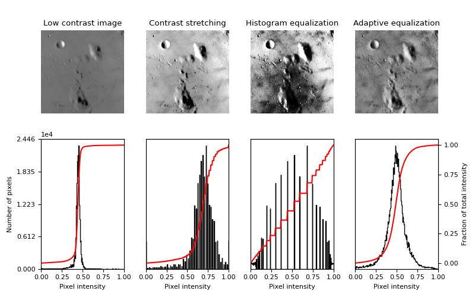
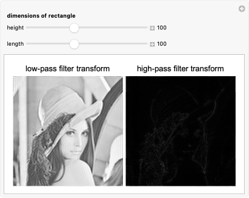
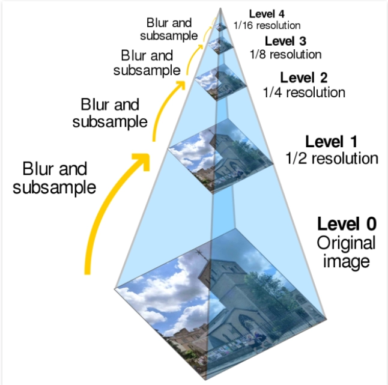

[Fourier Transformation](fourier.md)

[Morpholocial Operations](PCT_PCM/PCT_PCM7%20Notes/PCT_PCM7_notes.md)
- SE: Structuring Element
- Binary Image
- Erosion and Dilation
- Opening and Closing

#### Week wise notes
- [Week 1](Week1.md)
- [Week 2](Week2.md)
- [Week 3](Week3.md)
- [Week 4](Week4.md)

#### Contrast Stretching and Histogram Equalization


#### Low Pass/High Pass Filtering


#### Image Pyramid for Image resolution

```
Original
512×512
   ↓
Blur + ↓2
256×256
   ↓
Blur + ↓2
128×128
   ↓
Blur + ↓2
64×64


Here, ↓2 = downsampling
```