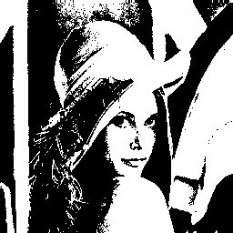
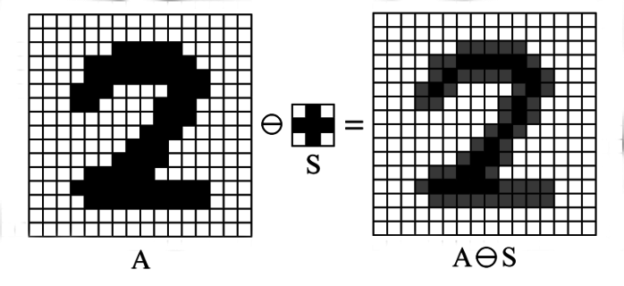
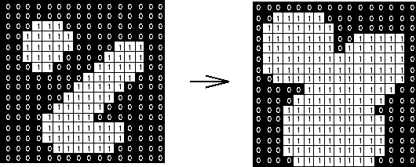
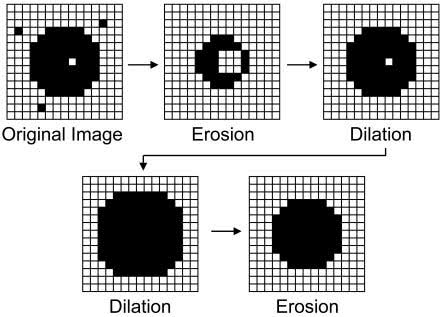

## Morpholocial Operations

### SE = Structuring Element.
In simple terms, a structuring element is a small shape/pattern that acts like a tool or stencil for morphological operations such as erosion and dilation.

### Binary Image
A binary image of a number picture in digital image analysis is a simplified black-and-white graphic where each pixel is restricted to exactly one of two values: 0 (black) or 1 (white).



### Erosion


### Dilation


### Erosion and Dilation


### Opening and Closing
**Opening:** Erosion -> Dilation<br>
**Closing:** Dilation -> Erosion

```
Opening = remove small foreground details

Closing = fill small background gaps/holes
```