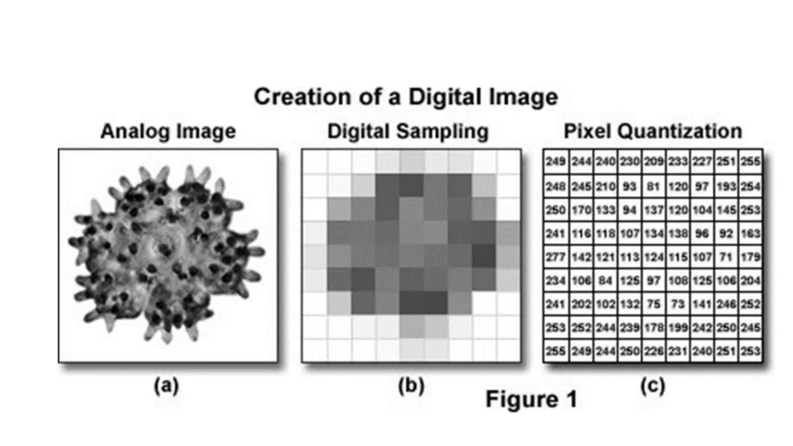
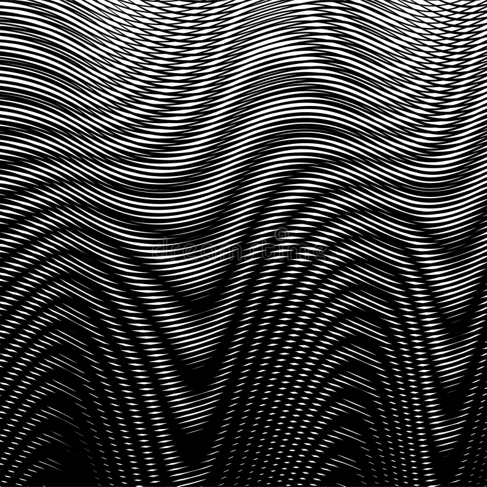
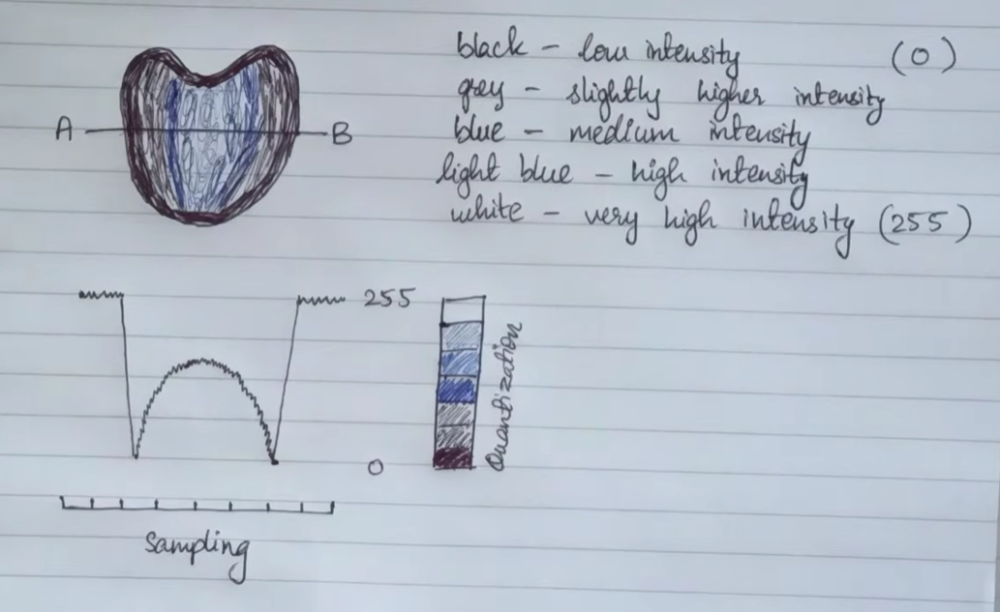
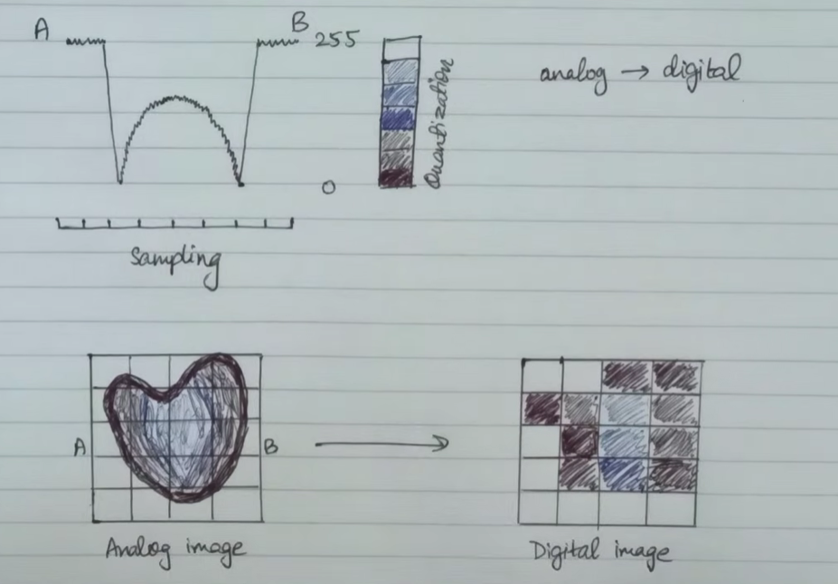
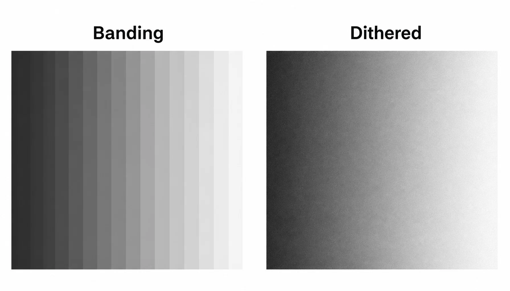

### Binary Image
- A binary image has only two values: {0,1}
- Used for Masks, Documents, Morpholocial Operations

### Gray Scale Image
- Contains intensity values.
- For an 8-bit image: 0-255 (0-black, 128-gray, 1-white)
- Used for:
    - Histogram
    - Filtering
    - Edge detection

### Colour / RGB Image
- 3 Channels (256-red, 256-green, 256-blue)

### Float Images
```
uint8: 0     128     255
float: 0.0   0.50    1.0
```
- Used heavily during:
    - Image processing
    - Mathematical operations
    - Machine learning

### Image shape, Dtype and Range
- shape = (512, 512)
- dtype = uint8
- range = 0–255

### Spatial Resolution
- It means how much spatial detail an image can represent.
- High spatial resolution
```
████████████████
████████████████
████████████████

Lots of pixels → fine details visible.
```
- Low spatial resolution
```
███ ███ ███
███ ███ ███
███ ███ ███

Large pixels → small details disappear.
Low spatial resolution → blockiness / loss of detail
```

### Intensity Resolution
- `L = 2^b`
- b - 8 bits, L = 256
```
More bits -> More intensity levels -> Smoother brightness changes
```

### Quantisation
- A real sensor can measure a continuous range of values.
- But a computer cannot store infinitely many values.
- So we convert:
```
Continuous values
       ↓
Discrete intensity levels
```
This process is called **quantisation**.


### Spartial Resoluation vs Intensity Resolution
| Spatial Resolution                | Intensity Resolution       |
| --------------------------------- | -------------------------- |
| Number/density of spatial samples | Number of intensity levels |
| Controls spatial detail           | Controls brightness detail |
| Low → blockiness                  | Low → banding              |
| Related to sampling               | Related to quantisation    |

```
Spatial → WHERE
Intensity → HOW BRIGHT
```

### Dynamic range
- How wide is the range between the weakest and strongest distinguishable intensity?
```
Dynamic range
←──────────────────────→
dark                  bright

Bit depth
| | | | | | | | | | | |
how finely this range is divided
```

### Saturation / Clipping
- If max value is 255 then everything above this brightness level is clipped
```
250 - 250
135 - 135
260 - 255
380 - 255
```

### Sampling
- Converting continuous spatial information into discrete 
pixels.



### Sampling Frequency
- This tells how many samples are taken per unit distance.
- fs -> samples/mm

### Nyquist Sampling Condition
- `fs > 2 * fmax`
- fmax -> maximum spatial frequency

### Aliasing
- `fs < 2 * fmax`
- Real life example: Car wheel -> appear to rotate backwards

### Moire Pattern
- It is a visible false pattern produced when repetitive fine structures interact with insufficient sampling.



### Downsampling
- Original Image (4000x4000) -> Downsampled image (1000x1000)
- We are reducing the number of samples, that's downsampling.
- A dangerous method is simply `img[::4, ::4]`, because this can cause aliasing.
- Safe downsampling
```
High-resolution image -> Anti-alias filter -> Downsample -> Low-resolution image
```

#### Sampling and Quantisation
- Digitizing = Sampling + Quantisation




### Aliasing and Quantization
|                     | Aliasing                            | Quantisation                       |
| ------------------- | ----------------------------------- | ---------------------------------- |
| Problem with        | Spatial positions                   | Intensity values                   |
| Cause               | Too few samples                     | Too few intensity levels           |
| Main artefact       | Moiré, false patterns, jagged edges | Banding / false contours           |
| Affects             | Fine repetitive structures          | Smooth gradients                   |
| Prevention          | Pre-filter before sampling          | More bits / dithering              |
| Can it be reversed? | No                                  | Lost precision cannot be recovered |

### Dithering
- **The Problem:** When you compress an image or lower its bit-depth, you get harsh color transitions called color banding.
- **The Solution:** Dithering intentionally introduces strategic visual noise or pixel patterns. By scattering pixels of available colors right next to each other, it tricks the human eye into blending them into a smooth gradient or a completely new color.



### Spatial Resolution, Intensity Resolution and Dynamic Range
- Spatial resolution
    - Controls: How much spatial detail?
    - Low → blockiness.
- Intensity resolution
    - Controls: How many brightness levels?
    - Low → banding.
- Dynamic range
    - Controls: How wide a brightness range can be captured?
    - Poor → clipping / inability to distinguish very dark and bright regions.