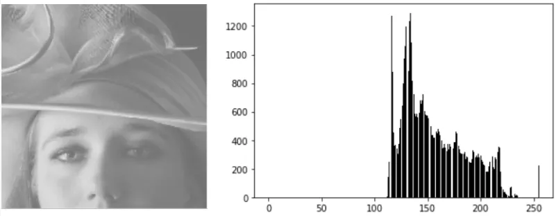
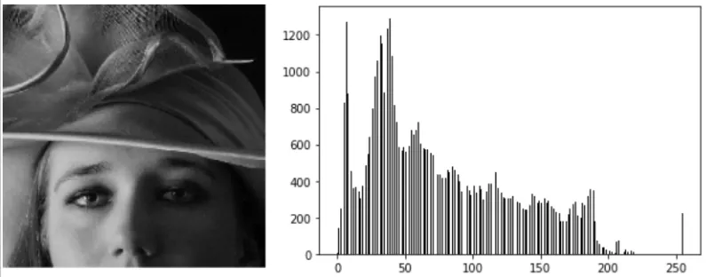
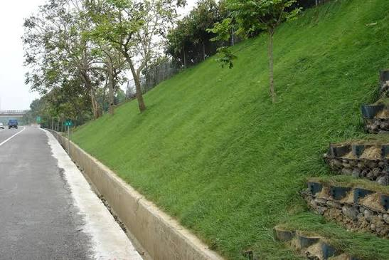

### Pixel Neighbourhood
- N4 - up, down, left, right
- ND - all 4 diagonals
- N8 - up, down, left, right + all 4 diagonals

### Adjacency
- This tells us whether two pixels are considered connected.
- **4-Adjacency** - 2 pixels are connected if they share same edge (eg. 1 1)
- **8-Adjacency** - 2 pixels are connecte dif they share same edge as well as same diagonal
    ```
    1 0
    0 1

    They are connected in 8-adjacency but not in 4-adjacency
    ```
- **m-Adjacency (mixed-adjacency)**
    - It was introduced to avoid unwanted multiple paths created by 8-adjacency.
    - A diagonal connection is allowed only when the two pixels do not have a common foreground 4-neighbour.

### Connectivity
- Connectivity tells us whether pixels form a single connected component/object.
- Depending on whether you use 4- or 8-connectivity, the number of objects can change.
- Example:
```
1 0 0
0 1 0
0 0 1

4-connectivity → 3 connected objects/components (broken into separate pieces)

8-connectivity → one connected object/component
```

### Connectivity Paradox
- If we use 8-connectivity for both foreground and background, strange situations can occur.
- Use complementary connectivity:
    - Foreground → 8, Background → 4, or
    - Foreground → 4, Background → 8

### Colour Spaces
- RGB - Red, Green, Blue
- HSV
- YCbCr
- CIE-Lab

### HSV Colour Space
- **H: Hue**
    - What colour is it?
    - Examples: red, green, blue, etc.
- **S: Saturation**
    - How pure/intense is the colour?
- **V: Value**
    - How bright is it?
```
High S → strong colour
Low S → greyish colour

HSV
 ├── H → colour
 ├── S → purity
 └── V → brightness
```
- **Uses**
    - Colour segmentation
    - Object detection
    - Colour-based rules
- **Remember:** Low saturation → Hue is unreliable.

### YCbCr Colour Space
$$ \boxed{Y=0.299R+0.587G+0.114B} $$
```
- Y → brightness/luma
- Cb → blue chroma
- Cr → red chroma
```
- **Uses**
    - JPEG
    - Video
    - Compression
    - Skin detection
    - Processing brightness separately

### CIE-Lab
```
- L* → Lightness
- a* → Green ↔ Red
- b* → Blue ↔ Yellow
```
- **The major advantage:** Lab is designed to represent colour differences more closely to human perception.
- Therefore, it is useful for measuring colour difference.
- **Color Difference (ΔE):**
$$ \boxed{\Delta E=\sqrt{(\Delta L)^2+(\Delta a)^2+(\Delta b)^2}} $$

| Space     | Main idea                        | Best use          |
| --------- | -------------------------------- | ----------------- |
| **RGB**   | Device colours                   | Input/display     |
| **HSV**   | Colour + purity + brightness     | Colour detection  |
| **YCbCr** | Brightness separated from colour | Compression/video |
| **Lab**   | Perceptual colour                | Colour difference |

```
Easy memory

RGB → Display
HSV → Detect colour
YCbCr → Compress
Lab → Compare colours
```

### Luma vs Chroma
- **Luma:** Contains most of the image structure/detail. (eg. Edges, Shapes, Objects, Texture)
- **Chroma:** Contains colour information.

### Point Operation
- A point operation applies the same mathematical function independently to every pixel.
$$ \boxed{s=T(r)} $$
- It doesn't look at neighbouring pixels.

### Negative Transformation
- For an 8-bit image:
$$ \boxed{s=255-r} $$
- It reverses intensity.

### Log Transformation
$$ \boxed{s=c\ln(1+r)} $$
```
Dark values → spread out
Bright values → squeezed together
```

### Gamma Transformation
$$ \boxed{s=c r^\gamma} $$

### Contrast Stretching
- Sometimes the image uses only a small portion of the available intensity range.
- Example:
    ```
    Original:

    50 ───────────── 150

    Available:

    0 ───────────────────── 255
    ```
- Contrast stretching expands:
    ```
    50 → 0
    150 → 255
    ```
- So the image uses more of the available intensity range.
- **Use:** When you have a known useful intensity range that you want to expand.




### Piecewise Linear Contrast Stretch
- Instead of one formula, different intensity ranges can have different slopes.
```
Output
  |
255|          /
   |         /
   |       /
   |_____/
   |
   +---------------- Input
       r1   r2
```

The slope determines how much contrast is gained in that region.

### Slope = Local Contrast Gain
This is an important conceptual point.

For a transformation curve:
$$ s=T(r) $$
the slope tells you how strongly contrast is changed around that intensity.

- **Steep slope**
    - small input differences become large output differences
    - detail becomes more visible.
    

- **Flat slope**
    - differences get compressed
    - detail is lost.

The lecture explicitly describes the slope as the local contrast gain.

### Noise Amplification
- This is an important limitation of gamma/log transformations.
- For:
    - Gamma with γ < 1
    - Log transformation

- the dark region has a steep curve.
- That means:
    ```
    Signal ↑
    Noise  ↑
    ```
- So while dark details become brighter, noise can also become more visible.
- **Therefore,** For low-light images, Brightening alone is not enough, denoising may also be required.

### Outlier Problem in Contrast Stretching
Suppose almost all pixels are between:
```
40 and 180
```
but one pixel is:
```
255
```
A normal min-max stretch may use:
```
min = 40
max = 255
```
That one outlier affects the entire stretch.

**Solution**

Use percentile-based stretching.

The notes recommend approximately:

$$ \boxed{2^{nd}\text{–}98^{th}\text{ percentile}} $$

instead of blindly using minimum and maximum.