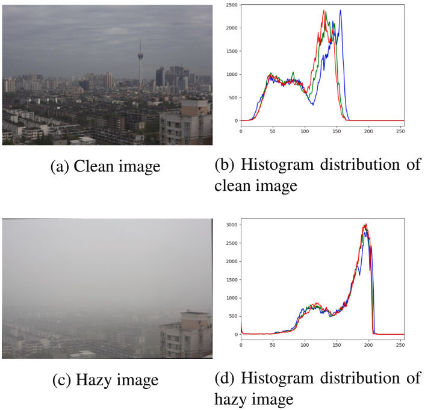
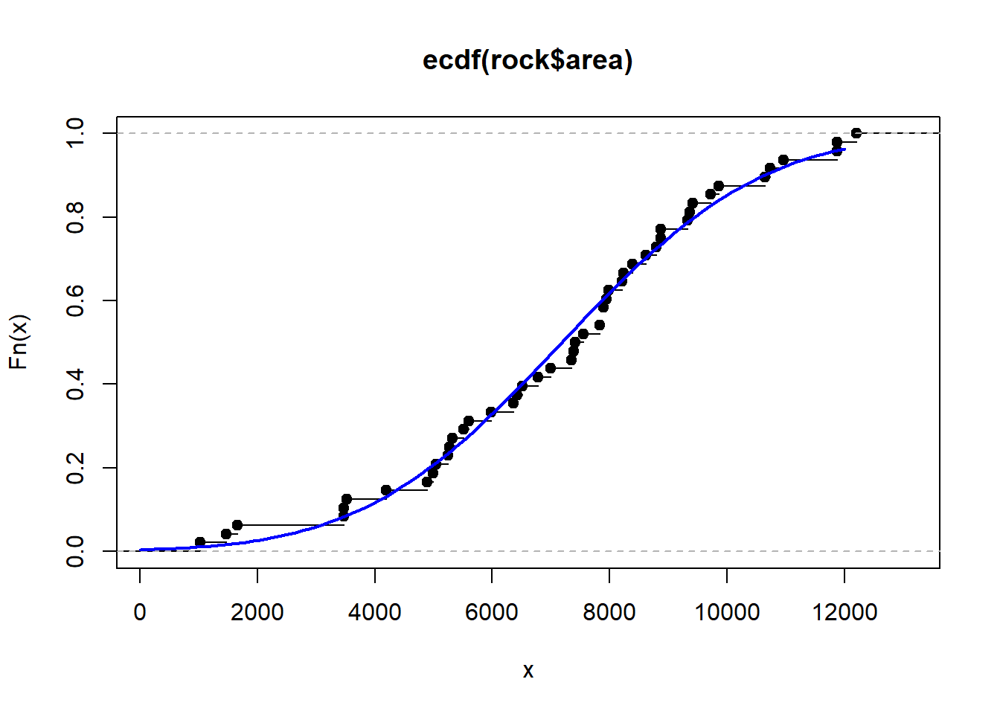

### Histogram
- Histogram shows how many pixels occur at each intensity.
- It doesn't care where a pixel is, only how many pixels have a particular intensity.



### Normalised Histogram
- Instead of counting pixels, we count probabilities
- Probability = pixels at that intensity / total pixels

$$ p(r_k)=\frac{n_k}{MN} $$

### CDF (Cumulative Distribution Function)

- Instead of asking: "How many pixels have intensity 50?"
- we ask: "How many pixels have intensity ≤ 50?"
- So CDF keeps adding probabilities as intensity increases.



- Where the histogram has lots of pixels, the CDF rises quickly

### Histogram Equalisation (HE)
- Problem: Suppose an image uses only: `20 25 30 35 40`
- instead of the whole: `0 -------------------- 255`
- The image will look dull/low contrast.

- Idea of HE
    - Histogram Equalisation remaps intensity values so that the available intensity range is used more effectively.

Formula:

$$ s_k = round[(L-1)\times CDF(r_k)] $$

Where:

- L = number of intensity levels
- CDF = cumulative probability
- s_k = new intensity

```
If many pixels are packed around intensity 30:

Before:
20 21 22 23 24 25 26 27 28 29 30
                  ███████████

HE spreads them:

After
20     40      70      100
 █      █       █        █
```

### AHE — Adaptive Histogram Equalisation
- Global HE uses: ONE histogram for the entire image.
```
Imagine:
┌──────────────────────┐
│ bright sky           │
│                      │
│       dark object    │
└──────────────────────┘

AHE Divide image into small tiles
┌────┬────┐
│ H1 │ H2 │
├────┼────┤
│ H3 │ H4 │
└────┴────┘

Now perform histogram equalisation locally.
```

### CLAHE (Contrast Limited Adaptive Histogram Equalisation)
- Think: AHE + noise control
- CLAHE limits how much the histogram can be amplified using a clip limit
- Clip limit = controls local contrast/noise amplification
```
HE → Global
AHE → Local
CLAHE → Local + Controlled
```

| Method    | Main idea                     | Problem                       |
| --------- | ----------------------------- | ----------------------------- |
| **HE**    | One histogram for whole image | Poor with uneven illumination |
| **AHE**   | Histogram for local regions   | Amplifies noise               |
| **CLAHE** | Local histogram + clipping    | Needs clip-limit tuning       |

### Kernel / Filter

Example:
```
1  1  1
1  1  1
1  1  1
```
This is a kernel.

- Multiple and add all the pixel values of the kernal to the corresponding pixel values of the image = one pixel value
- Then move the kernal by one pixel left, do this until whole image is traversed

### Correlation

In correlation: Kernel is used as it is.
```
1  2  3
4  5  6
7  8  9
```
Conceptually:

$$ g(x,y)=\sum w(s,t)f(x+s,y+t) $$

### Convolution

In convolution: Flip the kernel first, then apply it.
```
9  8  7
6  5  4
3  2  1
```

$$ g(x,y)=\sum w(s,t)f(x-s,y-t) $$

The difference is essentially:
```
Correlation:
kernel → use directly

Convolution:
kernel → FLIP → use

----

Correlation = convolution for symmetric kernels like below

1 2 1
2 4 2
1 2 1
```

### Spatial Filtering
- Spatial filtering means:
- Modify a pixel based on its neighbouring pixels.
- Main filters:
    - Box filter
    - Gaussian filter
    - Median filter
    - Bilateral filter
    - Sharpening filter

### Box Filter / Mean Filter
- Example:
```
1 1 1
1 1 1
1 1 1
```
- Take the average of neighbouring pixels.
- Effect
```
Noise ↓
But
Edges ↓

So it produces blur
```
- **Use when:**
    - mild noise
    - speed is important
- **Don't use when:** preserving edges is important.

### Gaussian Filter
- Instead of giving every neighbour equal importance, **Gaussian** gives more importance to the centre.

Conceptually:
$$ \frac{1}{16}\left[\begin{matrix}1&2&1\\ 2&4&2\\ 1&2&1\end{matrix}\right] $$

- **Used for:**
    - Gaussian-like noise
    - smoothing
    - pre-processing before sampling/downsampling
- It is also separable, which makes it computationally efficient.

### Median Filter
```
10  11  12
10 250  11
9   10  12

Median:
9,10,10,10,11,11,12,12,250
             ↑
            11

So output = 11.
```
- **Best for:** Salt-and-pepper noise (Because extreme values don't strongly affect the median.)

### Bilateral Filter
- Bilateral filtering does something clever: Smooth similar pixels but preserve edges.
- **Use:** Denoising while preserving edges.

### Sharpening
- Sharpening tries to make edges/details stronger.

Basic idea:

$$ g=f+\lambda(f-f_{blur}) $$

### Choosing Filters
| Problem                  | Suitable filter |
| ------------------------ | --------------- |
| Mild/general smoothing   | Box             |
| Gaussian noise           | Gaussian        |
| Salt & pepper            | Median          |
| Denoise + preserve edges | Bilateral       |
| Need sharper image       | Sharpen         |
