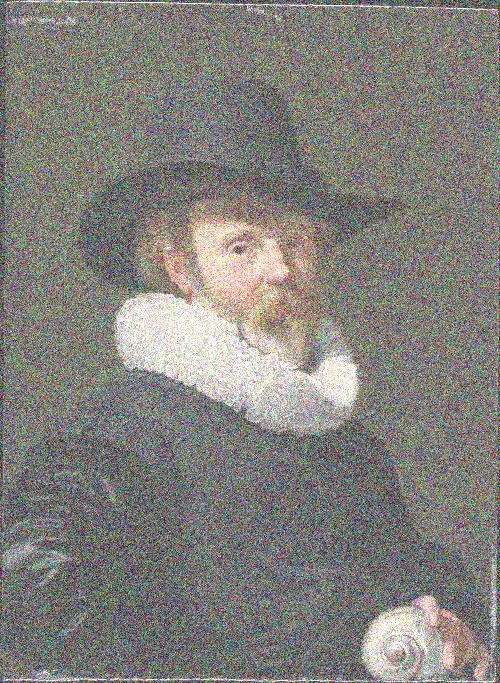
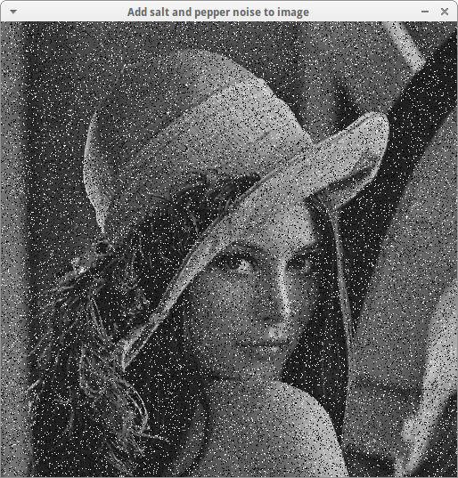
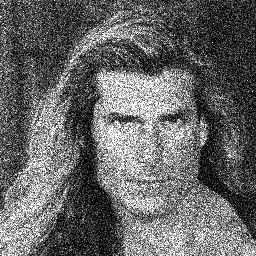
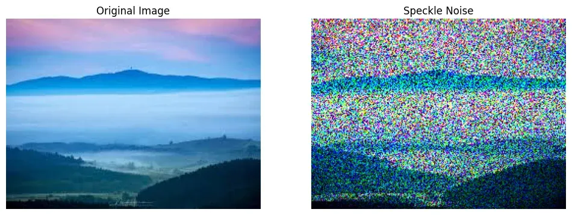
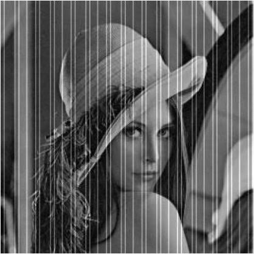

### Gaussian Noise
- Use Gaussian Filter to fix



### Salt and Pepper Noise
- Use Median Filter to fix



### Poisson Noise


### Speckle Noise


### Periodic Noise
- Periodic noise → Fourier spikes → Notch filter




### Identify the noise using histogram
| Histogram                          | Likely noise                       |
| ---------------------------------- | ---------------------------------- |
| Symmetric bell                     | Gaussian                           |
| Spikes at 0 and 255                | Impulse/Salt and Pepper Noise      |
| Width changes with brightness      | Poisson                            |
| Skewed and signal-dependent        | Speckle                            |
| Periodic pattern → spectrum spikes | Periodic                           |

```
So the basic workflow is:

Find flat region → Histogram → Identify noise → Choose filter
```


### Formulas
Degradation model
$$ \boxed{g=h*f+\eta} $$
Frequency domain
$$ \boxed{G=HF+N} $$
Noise estimation
$$ \boxed{\sigma^2=s_{obs}^2-s_{scene}^2} $$
Poisson
$$ \boxed{Var=\text{Mean}} $$
Speckle
$$ \boxed{g=f(1+n)} $$
Gaussian ±2σ
$$ \boxed{P(|\eta|>2\sigma)\approx4.6\%} $$

### One-line revision
```
Gaussian = electronics
Impulse = dead/error pixels
Poisson = photons
Speckle = coherent waves
Periodic = interference

Identify the noise first, then choose the filter.
```