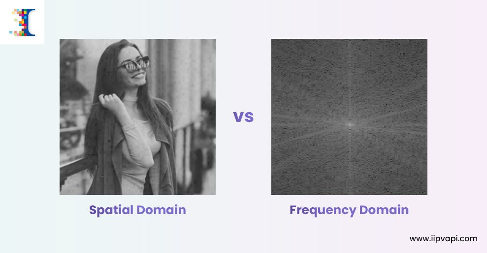
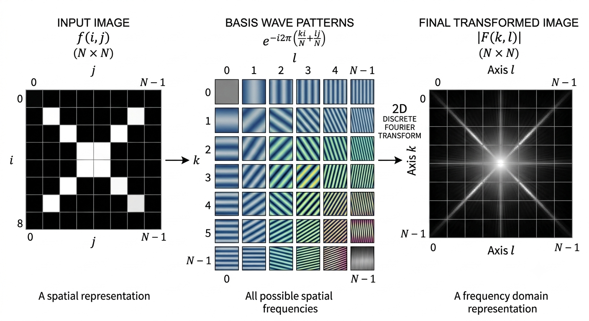

```
In image processing, spatial refers to the physical grid or coordinate space of an image where operations are performed directly on pixel values based on their (x, y) locations.
```

### Fourier
In digital image analysis, a Fourier transform is a mathematical tool that converts an image from the spatial domain (pixel brightness values) into the frequency domain (sine and cosine wave components)



**Fourier:** https://homepages.inf.ed.ac.uk/rbf/HIPR2/fourier.htm

**Gemini Explination:** https://gemini.google.com/app/673507ab3e6bf154?hl=en-IN



