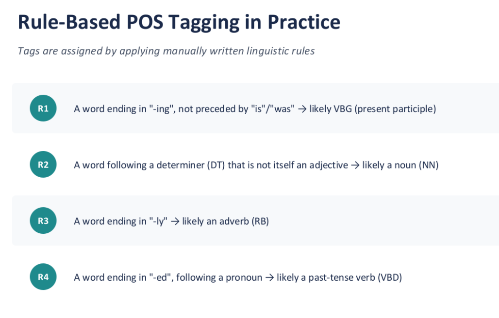
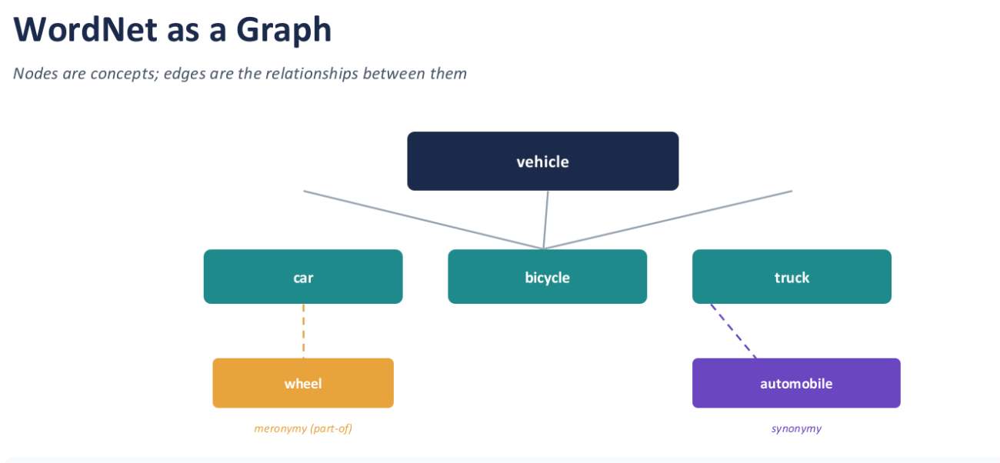

# N-Grams

$$ P(w_n \mid w_{n-1}) =
\frac{\operatorname{Count}(w_{n-1}, w_n)}
{\operatorname{Count}(w_{n-1})}
$$

**In simple words**: How often does the second word appear after the first word?

Example:
- `data drives` occurs 6 times
- `data` occurs 10 times
- Therefore: P(drives∣data)=6/10=0.6

### Applications of N-Grams
- Predict the next word.
- Autocomplete
- Predictive text
- Speech recognition

### Spelling correction using n-grams
```
piece of cake → high probability
peace of cake → low probability


Misspelled word
	↓
Generate possible words
	↓
Use N-gram probability
	↓
Choose best sentence
```

### Problems with n-grams
- **Data Sparsity**:
    - As N increases, possible combinations increase enormously.
    - So many valid combinations will never appear in training data.
- Example: If `"machine learning is powerful"` was never seen during training, a basic model may assign it `P = 0` (Probability = 0)

### Smoothing Techniques
- **Laplace (Additive) Smoothing:** Add 1 to every count computing probabilities, so no sequence ever gets exactly zero.
- **Add-k Smoothing:** A gentler version of Laplace - add a small constant k (eg. 0.1) instead of 1, to avoid overcorrecting.
- **Back-off (eg. Katz):** If a higher-order n-gram has zero count, fall back to a lower-order one (trigram -> bigram -> unigram).
- **Interpolation:** Blend probabilities from multiple n-gram orders together, weighted by how reliable each order is.

### Levenshtein Distance
- Three allowed operatins:
    - Insertion: add a character
    - Deletion: delete a character
    - Substitution: change/swap on character from another

# POS Tagging
- Assigning each word its grammatical role, based on meaning, position, and context.
- 'determiner, 'adjective', 'noun', 'verb', etc.

### Methods for POS Tagging
- **Rule-Based:** Handcrafted
- **Statistical:** Probabilities learned from large tagged corpora.
- **Neural:** Word embeddings combined with deep learning architectures.



---

### Decoding with the Viterbi Algorithm (notes not completed)
- Uses Dynamic Programming
- This algorithm is used for POS Tagging.

### WordNet: A Lexical Database
- Organizing English vocabulary by meaning, not just spelling
```
Synset example:

{ car, automobile }
```



- what WordNet's structure enables
	- Word Sense Disambiguation
	- Semantic Similarity
	- Ontology Building
	- Knowledge Graph Integration

### Word sense disambugations
- Determines the correct meaning of an ambiguous word from context.
- `The most “connected” sense in context is often the correct one`