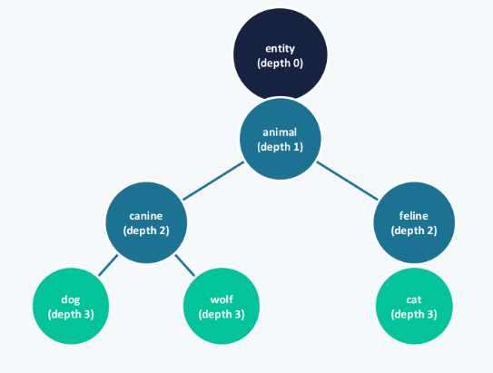
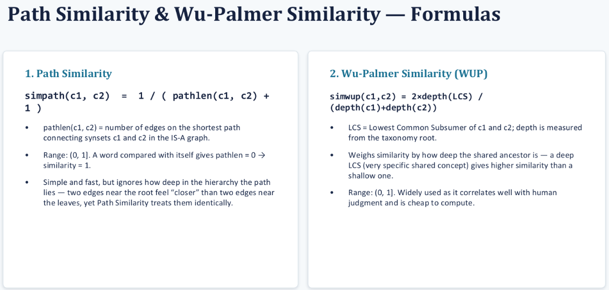
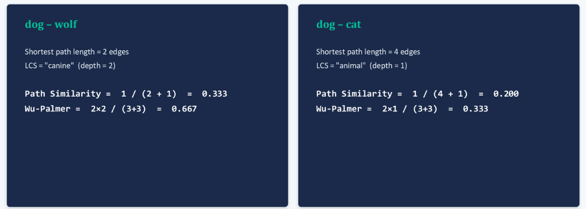
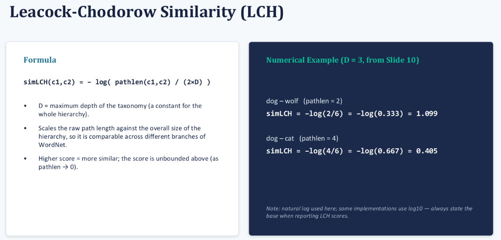

### Lexical Resource: A lexical resource is a structured collection of:
- Words
- Meanings
- Relationships between words
- Sentiment information
- Sometimes commonsense knowledge

### WordNet:
- WordNet is a lexical database of English developed at Princeton University
- It groups words into synsets

> A synset = group of synonymous words representing one particular meaning

| Relation       | Meaning                   | Example        |
| -------------- | ------------------------- | -------------- |
| **Hypernym**   | General / IS-A Up         | vehicle ← car  |
| **Hyponym**    | Specific / IS-A Down      | car → sedan    |
| **Meronym**    | Whole → part              | car → engine   |
| **Holonym**    | Part → whole              | engine → car   |
| **Antonym**    | Opposite                  | hot ↔ cold     |
| **Troponym**   | Specific manner of action | whisper → talk |
| **Entailment** | One verb implies another  | snore → sleep  |

### Synsets: The Atomic Unit of WordNet
- A synset (synonym set) groups words that are interchangeable in some context, representing a single, distinct sense.
- Each synset contains:
    - A set of synonymous lemmas (word forms)
    - A gloss — a short definition
    - Usually one or more example sentences
    - A unique synset offset / sense ID
- Semantic Relations Encoded in WordNet

### Path Similarity

### Leacock-Chodorow Similarity (LCH)
